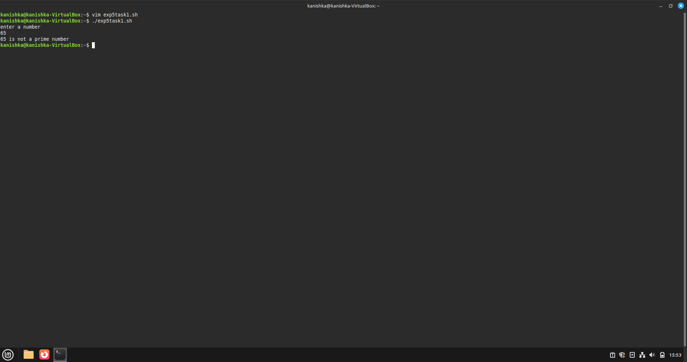
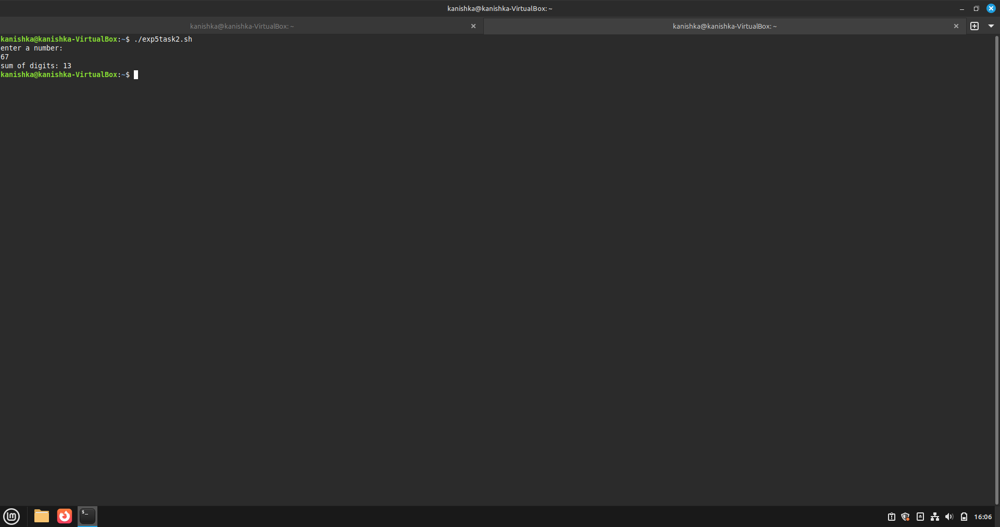

## Experiment [5]: [Shell Programming]

### Name: Kanishka Diwakar Roll No.: 590029336  Date:2025-09-28

### Aim:

* To understand and implement basic conditional statements in Bash scripting.

### Requirements:

* Any Linux distribution
* Text editor (VS Code, Vim, Notepad, Nano, etc.)

### Theory:

* This experiment focuses on the usage of **conditional statements and loops** in Bash scripting.
* It also covers fundamental concepts such as checking prime numbers, calculating the sum of digits, and verifying Armstrong numbers.

## Procedure & Observations

### Exercise 1: Prime Number Check

**Task:**

* Write a script to check whether a given number is a prime number.

**Explanation:**

* Using a `for` loop and conditional checks, the script verifies if a number is divisible by any other number (other than 1 and itself).

* script1:

#!/bin/bash
echo "Enter a number: "
read num
flag=0

for ((i=2; i<num; i++))
do
    if [ $((num % i)) -eq 0 ]
    then
        flag=1
        break
    fi
done

if [ $flag -eq 0 ]
then
    echo "$num is a prime number."
else
    echo "$num is not a prime number."
fi

* Output:

### Exercise 2: Sum of Digits
 
 * Task:

* Write a script to calculate the sum of digits of a number.

* Explanation:

* The script extracts each digit of the input number using modulus and division, then adds them together.

* script2:

#!/bin/bash
echo "Enter a number: "
read num
sum=0

while [ $num -gt 0 ]
do
    digit=$((num % 10))
    sum=$((sum + digit))
    num=$((num / 10))
done

echo "Sum of digits: $sum"

* Output:

### Exercise 3: Armstrong Numbers

**Task:**

* Write a script to check whether a given number is an Armstrong number.

**Explanation:**

* An Armstrong number of `n` digits is equal to the sum of its digits raised to the power `n`.
* Example: 153 = 1³ + 5³ + 3³.

* script:

#!/bin/bash
echo "Enter a number: "
read num
temp=$num
n=${#num}   # number of digits
sum=0

while [ $temp -gt 0 ]
do
    digit=$((temp % 10))
    sum=$((sum + digit**n))
    temp=$((temp / 10))
done

if [ $sum -eq $num ]
then
    echo "$num is an Armstrong number."
else
    echo "$num is not an Armstrong number."
fi

* Output:

### Result:

* The exercises were successfully executed, demonstrating the use of conditional statements, loops, and arithmetic operations in **basic shell scripting**.

